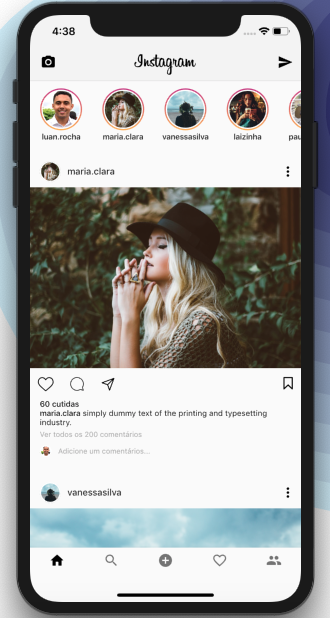
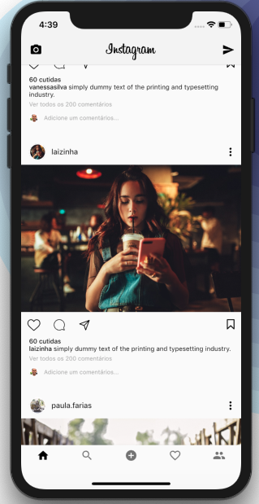

# Instagram with Flutter

A new Flutter application.

## Getting Started

Instagram Layout Example with Flutter

For help getting started with Flutter, view our 
[online documentation](https://flutter.dev/docs), which offers tutorials, 
samples, guidance on mobile development, and a full API reference.
